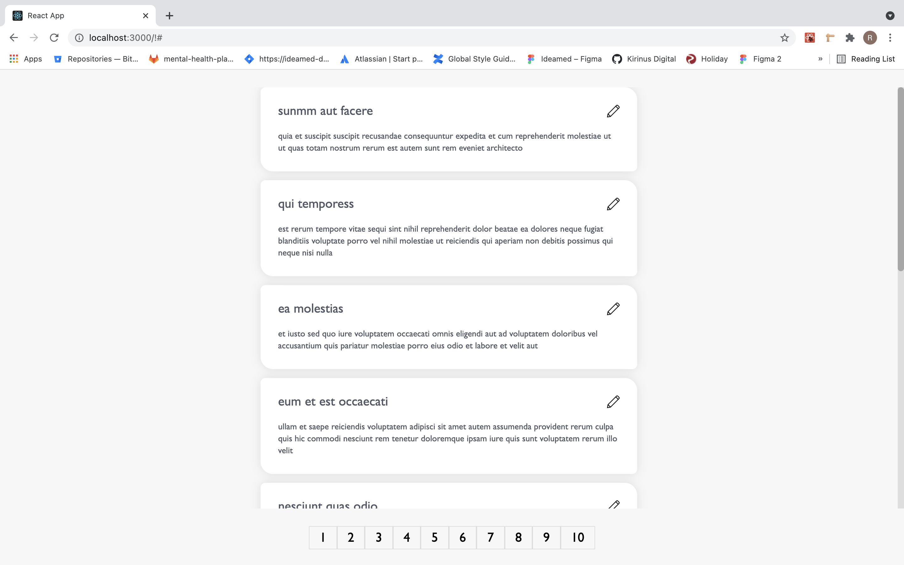
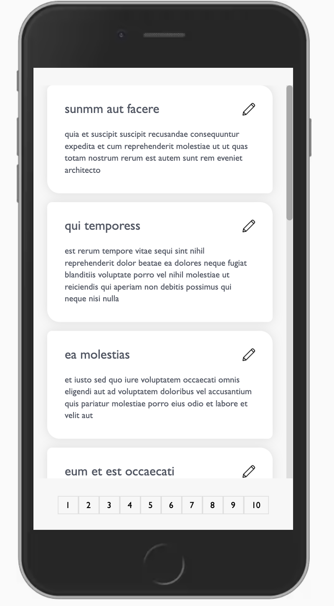

# Posts

This project was created using React 17, Redux Saga and latest hooks and custom hooks. Can be used to view and edit posts.

## Available Scripts

In the project directory, you can run:

### `npm run dev`

Runs the app in the development mode. 

This simultaneously runs both FrontEnd and BackEnd (json server). 

Open [http://localhost:3000](http://localhost:3000) to view the FrontEnd on the browser.  

Open [http://localhost:8080/posts](http://localhost:8080/posts) to view the JSON on the browser.  

### `npm run test:unit:watch`

Launches the test runner in the interactive watch mode. 

### `npm run test:unit:update`

Launches the test runner with `-u` flag which updates all the snapshots 

## Application functionality.

* Allows the user to view all 100 posts by paginating.
* Allows the user to Edit the Title and/or Description.
* On click of Paginator below, loads appropriate 10 posts each.
* On Edit and Save, confirming alert is shown.